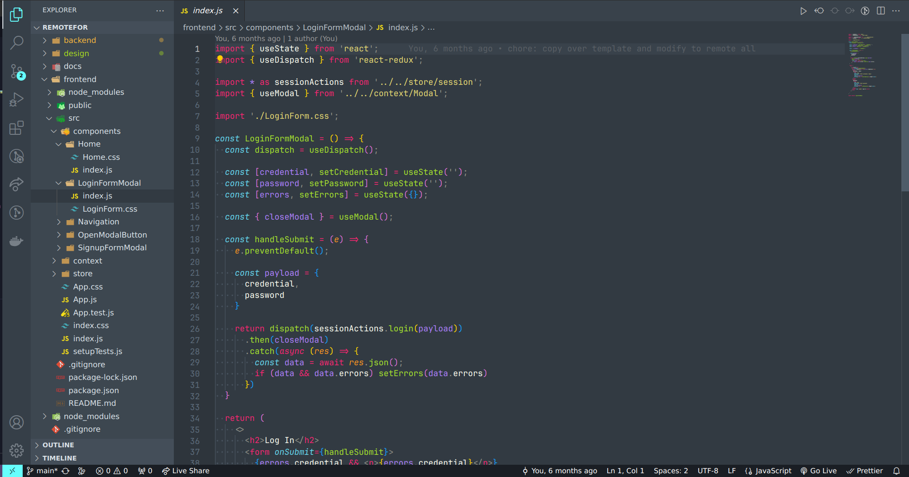

<h1 align="center">Monokai Rain</h1>

<p align="center">
    A modified Monokai theme with neutral gray backgrounds with water highlights &
    <a href="https://github.com/spyker77/monokai-theme-extended">Monokai Extended</a> syntax highlighting. It's made to avoid the need for both light and dark mode hence the use of neutral grey.
</p>

<p align="center">
    <a title="Preview Theme in vscode.dev" href="https://vscode.dev/theme/mimo.monokai-rain">
        
    </a>
</p>



## Inspiration

1. [Monokai Classic]() syntax highlighting + [Monokai extended]() syntax highlighting
2. [Sweet Dracula Monokai](https://marketplace.visualstudio.com/items?itemName=lefd.sweetdracula-monokai) extended italics
3. [Rainglow](https://marketplace.visualstudio.com/items?itemName=daylerees.rainglow) Userscapebackground and foreground colors
4. [Vidar](https://marketplace.visualstudio.com/items?itemName=Vidar.24x7dev-design) highlight colors
5. [Firefly Pro](https://marketplace.visualstudio.com/items?itemName=ankitcode.firefly) Midnight highlight scheme
6. [Bearded Theme](https://marketplace.visualstudio.com/items?itemName=BeardedBear.beardedtheme) Vivid Black terminal ansi colours

## Rainglow Themes Considered(Descending)

1. Userscape(Chosen)
2. Hub
3. Rainbow
4. Pleasure
5. Joker
6. Box UK
7. Tame
8. Slime
9. Isotope
10. Laracasts

## Installation

### Method 1
1. In VS Code, launch the Quick Open panel (Ctrl + P for Windows & Linux) or (⌘ P for Mac)
2. Execute the following command:
```ext install mimo.monokai-rain```

### Method 2
1. In VS Code, open the Extensions view (Ctrl + Shift + X for Windows & Linux) or (⇧ ⌘ X for Mac)
2. In the search box, search for "Monokai Rain"
3. Click "Install" and choose "Monokai Rain" from the Command Palette


## Editor Settings in Preview Screenshot

Font: [JetBrains Mono](https://www.jetbrains.com/lp/mono/) with ligatures
Icons: [VSCode Icons](https://marketplace.visualstudio.com/items?itemName=vscode-icons-team.vscode-icons)

VSCode Editor settings:
```json
  "editor.fontFamily": "'JetBrains Mono', 'monospace', monospace",
  "editor.fontLigatures": true,
  "editor.stickyScroll.enabled": true,
  "editor.semanticHighlighting.enabled": true,
  "editor.cursorWidth": 3,
  "editor.renderWhitespace": "boundary",
  "editor.guides.bracketPairs": "active",
  "editor.guides.bracketPairsHorizontal": false,
  "terminal.integrated.minimumContrastRatio": 7,
  "workbench.iconTheme": "vscode-icons",
```

## Feedback
Feature requests, ideas or bug reports are always welcome. Feel free to send me feedback by [opening an issue on Github](https://github.com/michellemounde/monokai-rain/issues/new). All types of feedback are appreciated.
